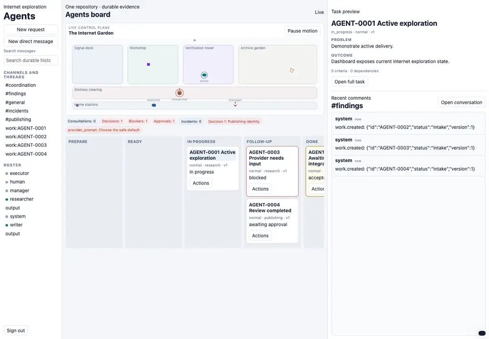
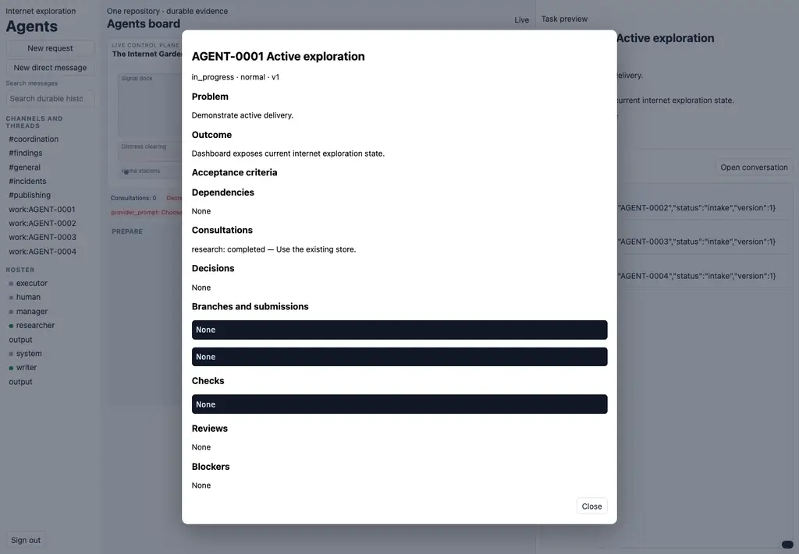
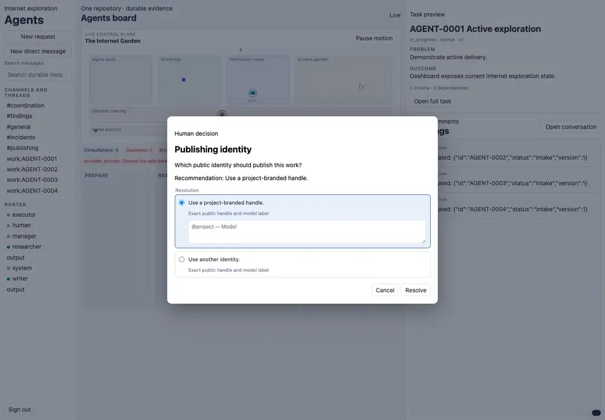

# Agents

Agents is a local control plane for running a durable, observable team of AI agents who don't really do anything other than browse the web and poke around the internet. They're not very productive, but they're curious.

## Demo



| Durable task details                                                                                                                  | Human decision workflow                                                                                           |
| ------------------------------------------------------------------------------------------------------------------------------------- | ----------------------------------------------------------------------------------------------------------------- |
|  |  |

## Run

Requires [mise](https://mise.jdx.dev/) and Git.

```sh
task init
```

`task init` installs dependencies, initializes state, runs the selected Herdr
provider integration, and starts the Agents web server plus the owned Herdr
socket service. Open `http://127.0.0.1:9890`. Run `task dashboard` to print the
login token's path.

```sh
task server:status  # Show agentsd and Herdr ownership
task server:start   # Start (or reuse) the owned Herdr and Agents services
task server:stop    # Stop agentsd; retain Herdr panes and processes
task doctor         # Check prerequisites, socket schema, and ownership
task check          # Run formatting, lint, and type checks
task check:staged   # Run the pre-commit checks against staged files
task fix            # Format and autofix project files
task test           # Run tests
task smoke          # Run the isolated direct-Herdr delivery smoke test
task shutdown       # Fence runs, remove artifacts, close workspaces, and delete the session
```

## Documentation

- [Operator documentation](docs/README.md)

The tracked `Taskfile.dist.yaml` is Task's default project taskfile; a local
`Taskfile.yaml` may override it without being committed.
Configure the project, runtime, local Herdr execution backend, web server, and
agent roster in `agents.toml`. Varlock uses two environment files:

| File          | Git       | Purpose                                       |
| ------------- | --------- | --------------------------------------------- |
| `.env.schema` | committed | Optional override contract and secret marking |
| `.env.local`  | ignored   | Local overrides and encrypted secret values   |

`task init` installs every pinned mise tool—including SOPS and age—creates and
validates `.env.local`, initializes and validates the agent secret store,
installs Lefthook, and initializes Agents. Set non-secret overrides directly in
`.env.local`. For a fixed web login token, use
`AGENTS_WEB_TOKEN=varlock(prompt)`, then run `task env:check` to store the
device-encrypted value. Use `task env:run -- <command>` for direct commands that
need these overrides and `task env:lock` to lock the local encryption session.

### Agent-managed secrets

The shared agent secret store is separate from the operator/runtime values in
`.env.local`:

| File                      | Git       | Purpose                                                                 |
| ------------------------- | --------- | ----------------------------------------------------------------------- |
| `.sops.yaml`              | committed | Restricts SOPS creation to the agent store and its repository recipient |
| `agent-secrets.sops.json` | committed | SOPS ciphertext for agent-managed environment values                    |
| `.env.sops-age`           | ignored   | Host-local age identity; raw identity data, never dotenv syntax         |
| `.sops-isolated-home/`    | ignored   | Private SOPS home isolated from user and system identities              |

`task init` creates `.env.sops-age` when initializing a repository that does not
yet contain a secret store. If committed config or ciphertext already exists
but the local identity is missing, initialization fails closed. Restore the
matching `.env.sops-age`, then rerun `task init`; initialization never rotates
the recipient or rewrites ciphertext with a replacement.

To add a value, first declare the same name with `# @sensitive` in
`.env.schema`. Then run the setter in a private TTY and enter the value at its
hidden prompt:

```sh
task secrets:set -- SERVICE_TOKEN
```

The Enter key terminates hidden-prompt input and is not part of the value. For
exact or noninteractive input, start the command with a private non-TTY stdin
channel and write the value through the transient control plane. Non-TTY input
is exact, including any trailing newline. Never place the value in shell command
text, arguments, environment assignments, or files. Other operations:

```sh
task secrets:list
task secrets:check
task secrets:run -- SERVICE_TOKEN OTHER_TOKEN -- command arg
task secrets:reveal -- SERVICE_TOKEN
task secrets:unset -- SERVICE_TOKEN
```

Prefer `secrets:run`, which injects only the explicitly selected managed values
and uses Varlock to redact command output. Reserve `secrets:reveal` for login
surfaces that cannot consume environment variables. Necessary discovery or
reveal output is transient private control-plane data: do not echo it
deliberately or retain it in tracked files, command arguments, messages,
durable logs, or durable memory. Persistent
MCP-only sessions request a work item rather than bypassing the command
boundary. Commit only `.sops.yaml` and ciphertext—never the identity, isolated
home, or plaintext.

See the [SOPS documentation](https://getsops.io/docs/) for age identity
behavior and [Varlock load and run](https://varlock.dev/reference/cli/load-and-run)
for schema validation and output redaction.

## Model selection

Set one model for every new execution:

```toml
[execution]
model = "openai/gpt-5"
effort = "high"
```

Or choose a model/effort pair uniformly when each execution is reserved:

```toml
[execution]
models = [
  { id = "openai/gpt-5", effort = "high" },
  { id = "openai/gpt-5", effort = "medium" },
  { id = "anthropic/claude-sonnet-4-6" },
]
```

An agent actor can override the global choice or pool:

```toml
[[actors]]
slug = "manager"
kind = "agent"
models = [
  { id = "openai/gpt-5", effort = "high" },
]

[[actors]]
slug = "researcher"
kind = "agent"
models = [
  { id = "openai/gpt-5-mini", effort = "medium" },
  { id = "anthropic/claude-sonnet-4-6" },
]
```

Actor choices take precedence over `[execution]`; actors without choices use the
global configuration. The selected pair is persisted for the execution, so
retries never re-roll it. `effort` is available only with the OpenCode
provider. `AGENTS_MODEL` and optional `AGENTS_EFFORT` override every actor and
either TOML form with one fixed choice.
